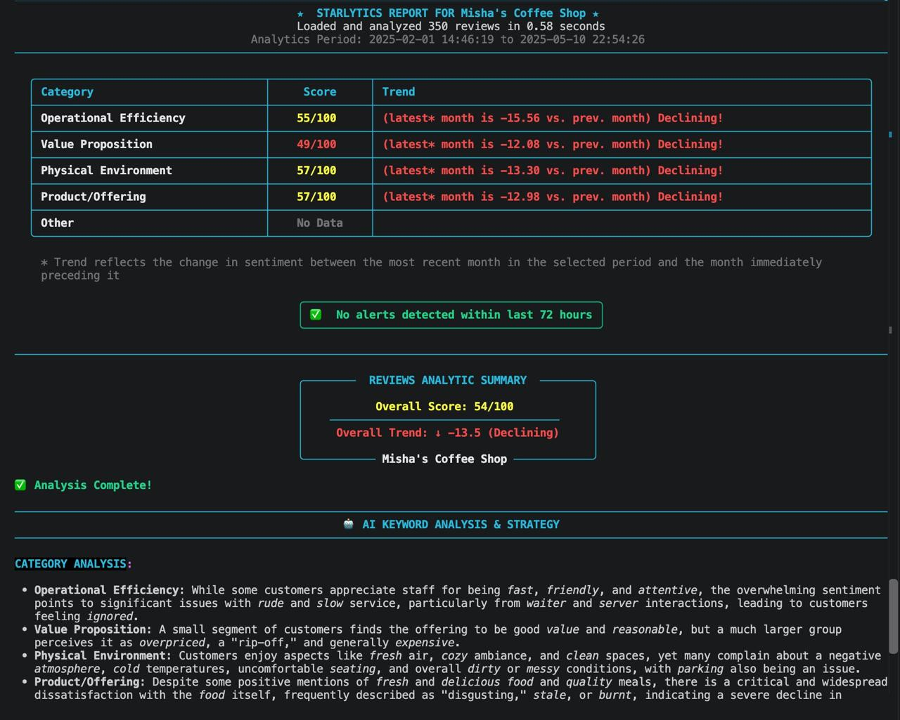
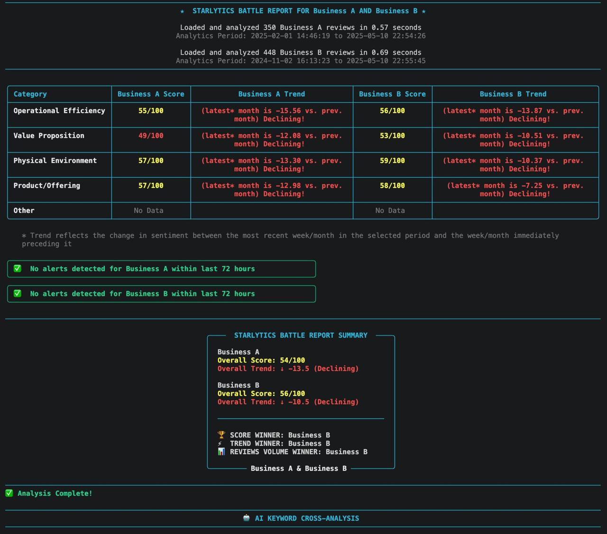
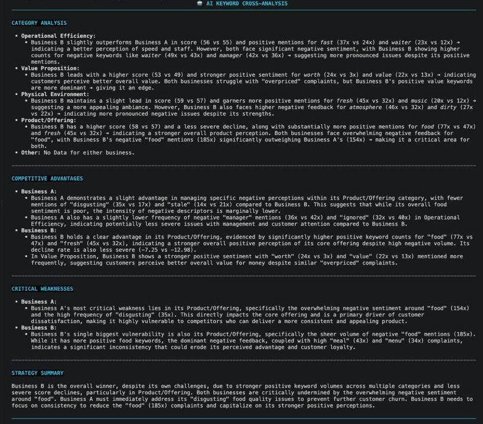

# ⭐ Starlytics*

*My final project after finishing CS50's Introduction to Programming with Python by Harvard

**A review analytics tool for businesses: point it at your customer reviews and get back where you're actually losing customers, how urgent it is, and what to do about it — plus how you compare to the business down the street.**

Feed it a CSV of reviews. Starlytics reads between the lines: it figures out *what* customers are actually talking about, *how* they feel about it, *when* things start going wrong, and *what you should do next* — all rendered as a live terminal dashboard, no browser required.

## Demo
**Solo Report**


**Battle Report**



## The problem

A star-rating average tells a business owner *that* something's wrong, not *what* or *how urgent*. Reading individual reviews gives anecdotes, not a structured signal — there's no easy way to tell whether the real issue is service, pricing, the space, or the product itself, whether it's a one-off complaint or a building trend, or how the business stacks up against a specific competitor. By the time a pattern is visible in the overall rating, it's already cost the business customers.

## What it does
 
- 🧩 **Diagnoses the "why" (Auto-categorization)** — automatically sorts reviews into five business areas (staff & service, pricing, ambiance/facilities, the product itself, and other) so an owner can see exactly which part of the operation is driving satisfaction or complaints
- ⚖️ **Scores sentiment beyond the star rating (Weighted Sentiment)** — blends the text of the review with its rating, so a 5-star review that mentions "a bit pricey though" still surfaces as a pricing signal worth watching
- 🚨 **Flags problems before they become patterns (Alert Engine)** — configurable alerts catch a bad streak (e.g. 3+ low-sentiment reviews in 72 hours) early enough to act on, rather than discovering it a quarter later in falling revenue
- ⚔️ **Benchmarks against competitors (Battle Reports)** — "Battle Report" mode runs a competitor's reviews through the same analysis and produces a head-to-head verdict: who's winning on service, who's winning on price, and what to do about it
- 🎯 **Turns data into a decision, not a dashboard (AI Strategy)** — rather than leaving the owner to interpret charts, an AI-generated report translates the scores into a plain-language strategy memo with concrete next steps

## Who it's for
 
Business owners (restaurants, salons, clinics, retail) who get plenty of reviews but no time or expertise to analyze them — and who want a competitive read on how they stack up against a specific rival, not just an industry-wide benchmark.

## How it works under the hood

1. **Categorize** — each review is matched against keyword sets (`categories_kw.py`) spanning four categories: Operational Efficiency, Value Proposition, Physical Environment, and Product/Offering. A review can land in more than one, or fall to "Other" if nothing matches.
2. **Score sentiment** — the review is split into clauses on conjunctions and punctuation, each clause scored with VADER, then blended with the star rating (`refine_score`: 70% stars, 30% VADER) into a 0–100 sentiment score per category.
3. **Extract keywords** — the top positive/negative keywords per category are surfaced, so a low score comes with a reason, not just a number.
4. **Watch for trouble** — `StarlyticsEngine` scans a rolling time window against your alert thresholds and raises general or category-specific alerts, with optional recency-weighted trend tracking.
5. **Generate strategy** — category scores and keywords are sent to Gemini, which returns a structured strategy report — or, in Battle Report mode, a competitive analysis naming a winner per category and an action plan.

## Tech stack

- Python 3
- [vaderSentiment](https://github.com/cjhutto/vaderSentiment) — sentiment scoring
- [rich](https://github.com/Textualize/rich) — terminal UI (menus, panels, tables, Markdown rendering)
- [google-genai](https://github.com/googleapis/python-genai) — Gemini API client for the AI strategy layer

## Installation
 
```bash
pip install -r requirements.txt
```
 
## Usage
 
```bash
export GEMINI_API_KEY="your_api_key"   # optional — only needed for AI strategy reports
python main.py
```
 
On Windows, use `set GEMINI_API_KEY=your_api_key` instead of `export`. The API key can also be set later from within the app (Settings → Set Gemini API Key).
 
Review data is read from CSV files with `stars`, `review_text`, and `date_string` columns — `mock_reviews.csv` for Solo Report, `mock_reviews_business1.csv` / `mock_reviews_business2.csv` for Battle Report.

## Known limitations / what I'd improve next

- Review CSV filenames are hardcoded rather than user-selectable.
- The main menu recurses into itself (`main()` calling `main()`) instead of using a clean loop — functional, but not how I'd do it with more time.
- No automated tests yet — correctness is currently verified manually against sample data.
- Settings live in memory only; persisting them between runs is next on the list.
- Not yet benchmarked for throughput at scale — real-time streaming ingestion (vs. batch CSV) is a natural next step.